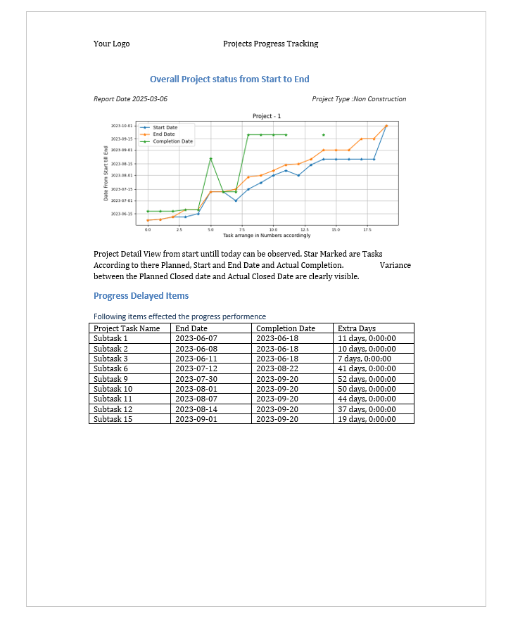

## Writing Reports 

### Storytelling with Reports

This repository provides Python examples for reference.  
Word and Excel remain standard tools for report creation, yet incorporating data visualizations is essential for effectively conveying analytical insights.
Also these report are email friendly and we can covert all document to PDF and send to different users. (We can code that too)
so lets do it !!!!!

## A Ms Word Document

After conducting data analysis, its very important to share the findings with the teams.
There are multiple ways to achive this. Using Dasbaords, Report lab.
Numerous tools, both free and paid, can support us in this process.

#### Ms Excel Document

Importance of communicate with end user is most important part of analtics and this need is highly served by MS Excel,
Enjoy some tips for using python Generating Ms Excel !!!!

