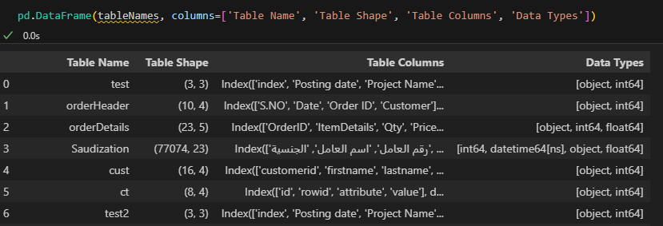
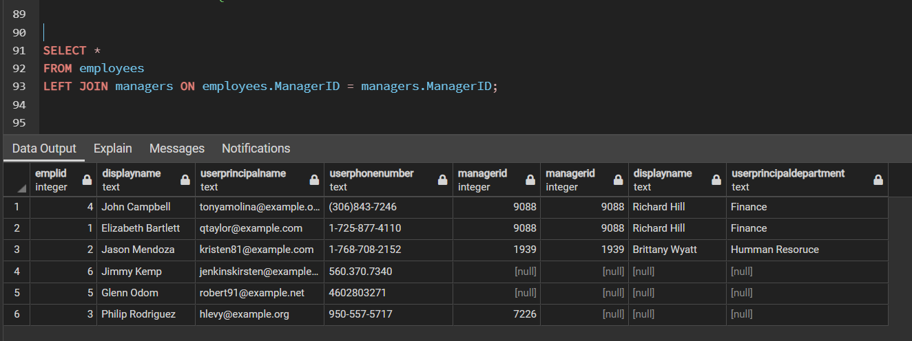

# [SQL](/SQL/SQLTableContents.ipynb)
## Nothing moves without SQL.

In the Journey of Data Analysis and Data Science Nothing moves without SQL.
One have to communicate with Data base in order to either retrive the data or push 
the Data.

In daily practise SQL-lite , duckdb and Arctic Db are good candidates which performs 
good fast data access. 

Comming from Pyton and data background it will be easy to use  one tool to access all databasis
and thanks to sqlalchemy they solve our problem. chieck this tool out it is really wonderful it
makes Communicating with data easy.

Almost all the python tools accept the sqlalchemy data connectivity importance of sqlalchemy cannot be ignored.

You will find my SQL Alachmy code written to find out the specific column with specific data type for creating a complex report.

# [PostgreSql](/SQL/EmployeesDemo.sql)
At this folder you we saw some SQL written at postgresql you can use pgadmin to run this or any other tool.

It cover the follwing in SQL
- Create Tables
- Populate Tables
- Link Tables
- Running Simple Select Query
- Query NULL & Not NULL
- Applying aggregate count() funtion.
- Using IN 
- SUB Querys
- Inner Joins 
- Left Joins

Note : please use Control + / & Control + Shift + / to comment and uncomment the lines.

