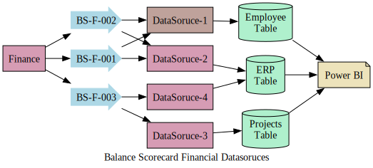

# Business Process Mapping

## Working with data and Analytics there are several step you have to show.

sometimes your are working on a project and you have to take approval of the workflow or you have pushed the rports to some common drive and you need to share the hirarchy to your team.

For these types of works, brings the need of an automated tools for flowcharting.

