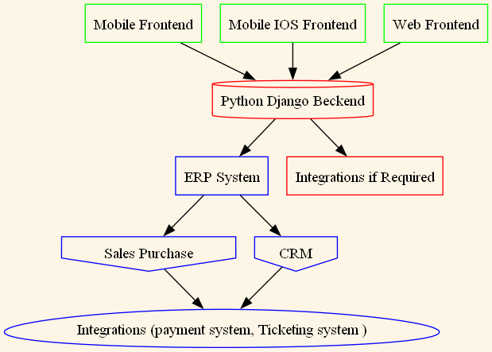
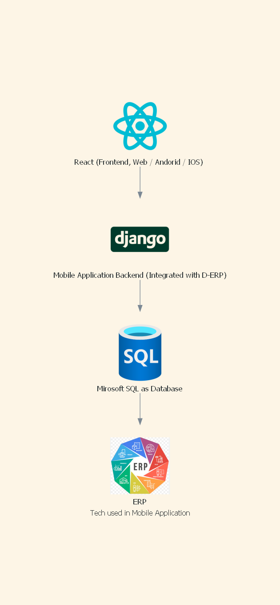

# Business Process Mapping

## Working with data and Analytics there are several step you have to show.

- Working on a project requires to take approval of workflows

- In collobrative working environment showing the folder structure and hirarchy is very important.

- Same helps when writing the documenatiton of any projects worked on.

For all of above, there is the need of an automated tools for flowcharting in the same working environment.

