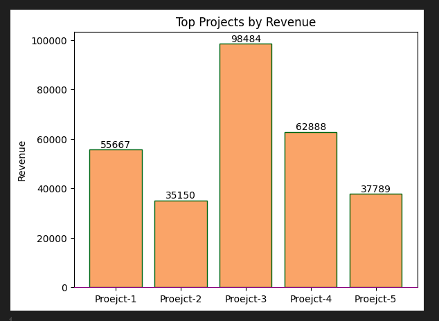
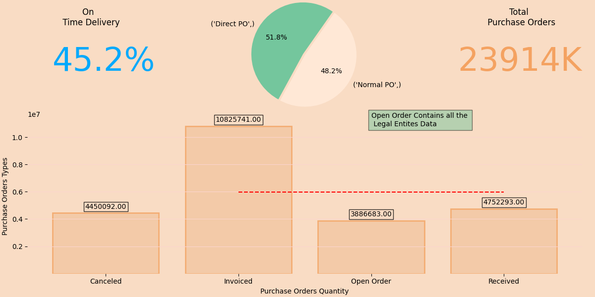

### Matplotlib 

## The Visualization Champion

when it comes to Data Visualization python Rocks.

In addition, the visiuals created in python can be utlized easily any other platform.

 

For example in Advance Reports created on excel or ms word we can utilized these visiuals.

Also, these beautiful and powerfull visuals can show up in Powerbi.

