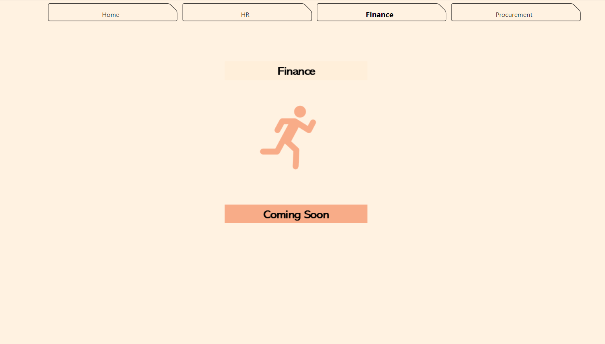
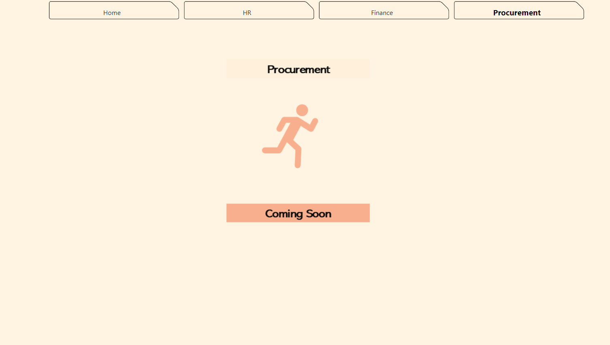

#### Power BI

One useful tool which can perform All the activities from Raw Data Handling to Complete Dashboard.

Consider this report as a simple report on different Datasourses including ERP, SQL database and other different sources.

ETL is not part of this Demo.

|
|

|
|
