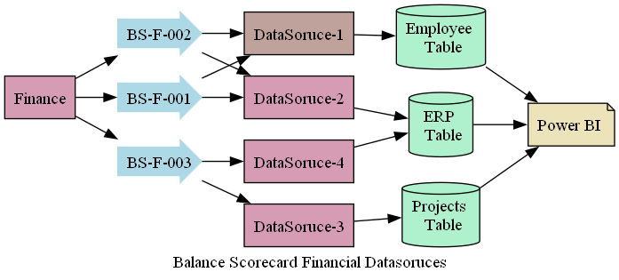
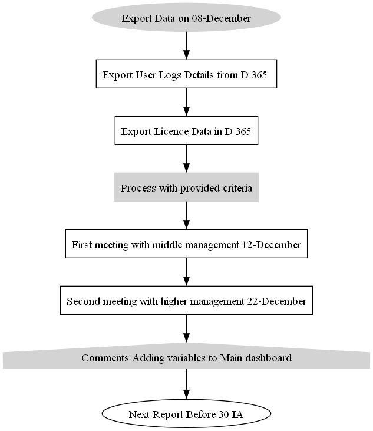
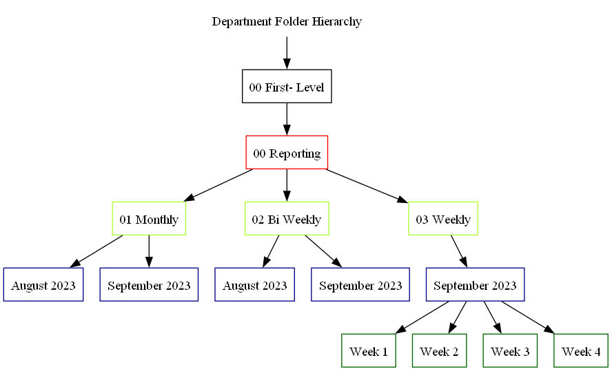
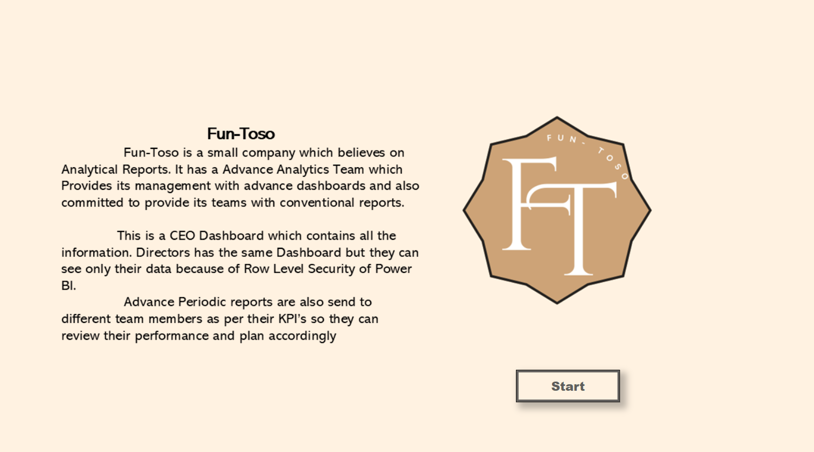
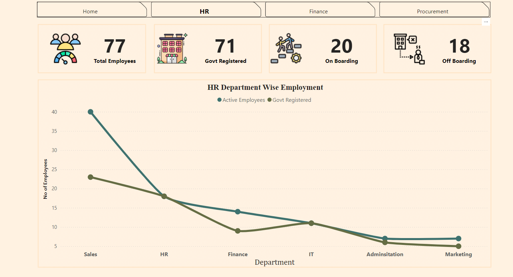

##### "Visuals are process 60,000 times faster , than text and 90% inforatmion is stored directly to the brain" 
###### (Book : Power of Visual Stories) 

The Do's and Donts of Visiuals

#### Do
- Avoid Clutter 
- Use Keep it Simple Approch
- Avoid High Contrast
- Make sure you provide clear messege without
- Properly created visiual will reduce unnecessary Dasboarding.

#### Don't
- Dont use Hi Contrast as it will ruin you messege.
- Dont create a cognative clutter for your user.
- Do Not bumbard your users with variety of visuals.
- Dont Make Visiual giving misleading messge.

Python:-

|
|
|

 

Power BI:-

|
|
